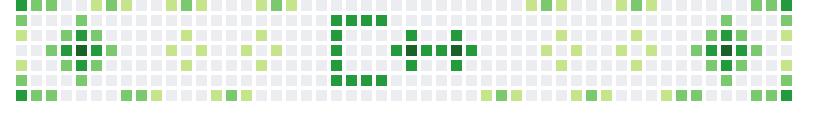

## Hi there 👋
<picture>
  <source srcset="result2.png" media="(prefers-color-scheme: dark)">
  <source srcset="result.png" media="(prefers-color-scheme: light)">
  
</picture>
 
- 📚 I’m currently studying at TU-Darmstadt
 
- 🖥️ I code in these languages: C/C++, C#, Java
 
- 🌱 I’m currently learning Qt
 
- 💬 Ask me about anything on Discord
 
- 📫 My Discord is: 0x8180
 
- ⚡ Fun fact: There are more possible configurations of a standard 2048-bit RSA encryption key than there are atoms in the observable universe.
